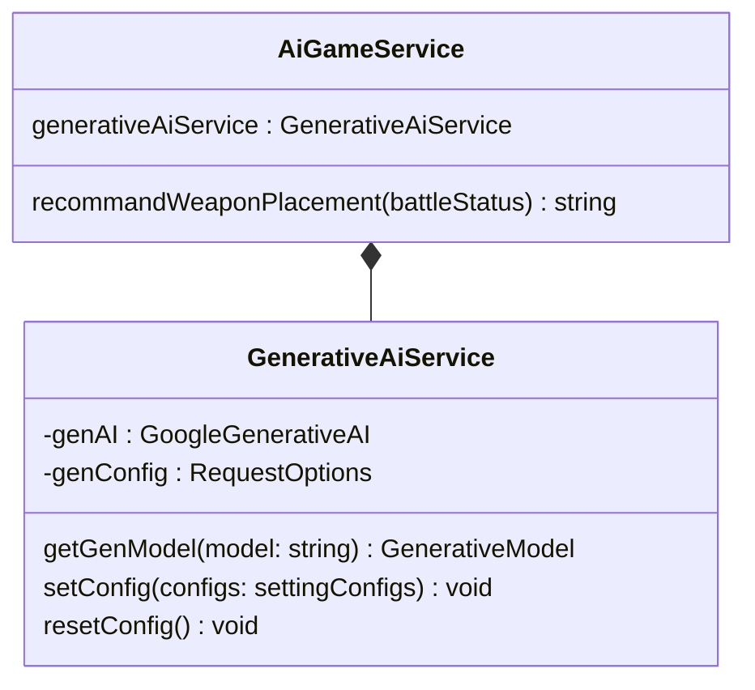
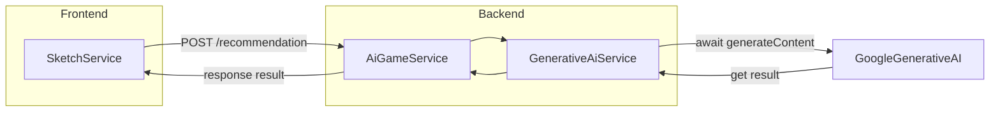

# AI Game Engine
Build by Node.js with Google Generative AI for gameplay recommendation

## Class Diagram

## Flow Chart

## References
* [Gemini API quickstart](https://ai.google.dev/gemini-api/docs/quickstart?lang=node)
